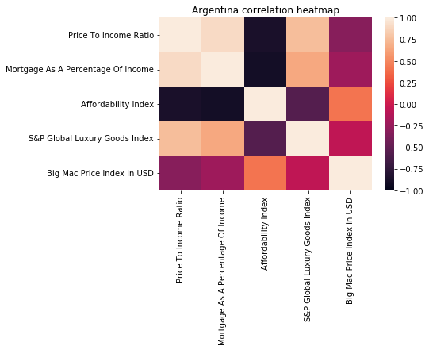
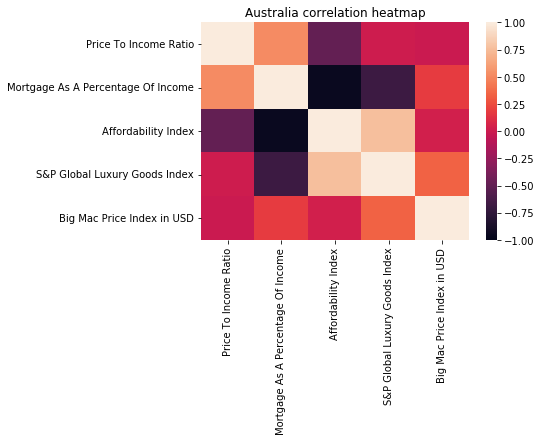
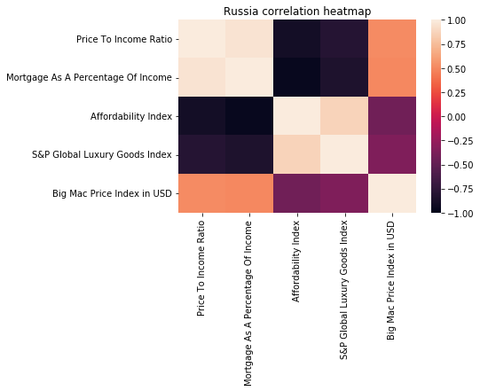

# Project-0• Title Slide
	• Include the name of the project, title of course, group members, and date.
	Project name: Project X
	
• Motivation & Summary Slide (Antonio)
	• Define the core message or hypothesis of the project.
If a particular country's housing affordability can be correlated to the price of big mac and luxury goods index
	• Describe the questions that were asked, and why they were asked.
	What defines housing affordability
	What relationship does each factor have with the price of big mac and luxury goods index
are the big mac indexes and luxury goods indexes a good indicator on house prices
	• Describe whether the questions were answered to your satisfaction, and briefly summarize the findings.
	Yes

• Questions & Data
	• Provide more detail on the questions posed, including what kind of data was needed to answer them, and where it was found.
	Where it was found:
Keggle a lady already cleaned up the dataset and fact check against other government database (https://www.kaggle.com/jolenech/property-prices-index-by-city-2009-to-2021)
	Numbeo (https://www.numbeo.com/property-investment/rankings.jsp)
	
• Data Cleanup & Exploration ()
	• Describe the exploration and cleanup process.
explain using notebook
	• Discuss any insights you had while exploring the data that you didn't anticipate.
Argentina has highest info/Singa/other country
	• Discuss any problems that arose after exploring the data, and how they were resolved.
- we had a lot of data from various countries and  wanted to get data from 2000 to 2021 but some countries did not have data prior to 2010 (e.g. big mac index, some countries did not have available data)
- we had to change our selected countries a few times
- we wanted to use parallel_categories to visualise data but will reduce the quality of data

	
	• Present and discuss interesting figures developed during exploration, ideally with the help of Jupyter Notebook.

• Data Analysis
	• Discuss the steps taken to analyze the data, and answer each question that was asked in your proposal.
	• Present and discuss interesting figures developed during analysis, ideally with the help of Jupyter Notebook.

• Discussion
	• Discuss your findings. Did they meet your expectations, and if not, why? What inferences or general conclusions can be drawn from your analysis?

• Postmortem
	• Discuss any difficulties that arose, and how they were handled.
	• Discuss any additional questions that arose, which couldn't be answered due to time constraints.
	• What would you research next if you had two more weeks?

• Questions
	• Open-floor Q&A with the audience.
	

